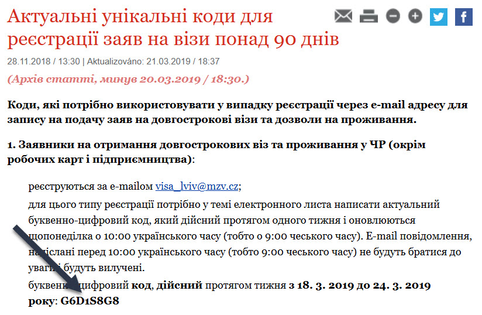
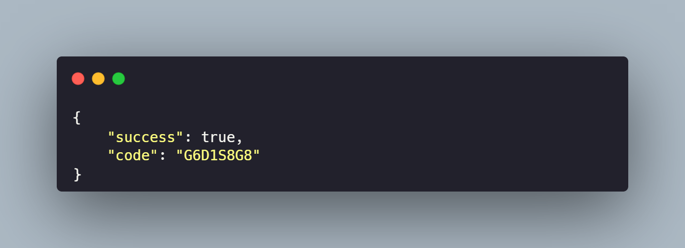

# Guzzle Cookie Playground

Demonstrating how to handle cookie-based access with Guzzle in plain PHP

## About

This project is a **plain PHP educational demo** that shows how to access a protected page
using [Guzzle](https://github.com/guzzle/guzzle), where cookies must be handled manually due to anti-DDoS JavaScript
logic.

We target this real-world [article code](https://www.mzv.cz/lvov/uk/x2004_02_03/x2016_05_18/x2017_11_24_1.html), which
displays a registration code after passing a client-side JavaScript protection step.



## Overview

When you directly access the target page, the server responds with JavaScript that sets a cookie and redirects back to
the same URL. This mechanism blocks simple HTTP clients like Guzzle from directly accessing the content.

Here's what the initial response looks like:

```html

<html>
<body onload="antidos()">
<script>
    function antidos() {
        document.cookie = "EWAAD=1c3580445beef1431db8353bd406009c; path=/";
        document.location.href = "https://www.mzv.cz/lvov/uk/x2004_02_03/x2016_05_18/x2017_11_24_1.html";
    }
</script>
<noscript>EWA CDN (D)DoS protection. Please, enable JavaScript and cookies to continue.</noscript>
</body>
</html>
```

## Solution

To work around this, we simulate the browser behavior with the following steps:

1. **Initial Request** – Make a request to `https://www.mzv.cz` to receive the protection cookie.
2. **Cookie Storage** – Extract and store the cookie using Guzzle's `CookieJar`.
3. **Follow-Up Request** – Make a second request to the actual page, sending the stored cookie.
4. **HTML Parsing** – Use `symfony/dom-crawler` to extract the registration code from the HTML.
5. **Return JSON** – Format and return the result as JSON.

## Tech Stack

* **Guzzle** – HTTP client for making requests
* **symfony/dom-crawler** – For parsing HTML and extracting data
* **Composer** – Dependency management
* **Docker** – For running the project in an isolated environment

## Installation

Clone the repo and install dependencies:

```bash
git clone https://github.com/tegos/guzzle-cookie-playground.git
cd guzzle-cookie-playground
composer install
```

To run it in a Docker container:

```bash
docker compose up -d
```

This will start the app on `http://localhost:8000`.

## Usage

After running the project, open your browser and navigate to:

```
http://localhost:8000
```

You will receive a JSON response like:

```json
{
  "success": true,
  "code": "G6D1S8G8"
}
```

## Example Output



## Disclaimer

This project is intended for **educational and demonstration purposes only.** The example shows how to interact with a
publicly accessible website using HTTP clients and cookies.

